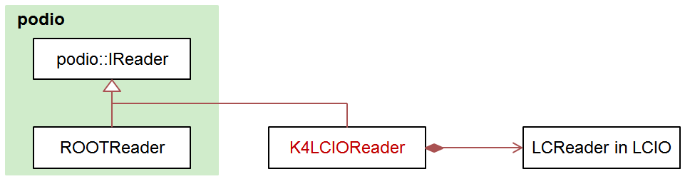

# k4LCIOReader

Generate EDM4hep collections from LCIO format data.

## Submodules

There are 2 modules in this project, k4LCIOReader and LCIOInput.

- Submodule LCIOInput: An algorithm wrapper of k4LCIOReader in Gaudi that can cooperate with k4FWCore.

- Submodule k4LCIOReader: In this module, `k4LCIOReader` is a subclass that inherits from `podio::IReader`. And it holds an instance of `LCIO::LCReader`.



## Dependencies

- [LCIO](https://github.com/iLCSoft/LCIO)
- [podio](https://github.com/AIDASoft/podio)
- [EDM4hep](https://github.com/key4hep/EDM4hep)
- [k4FWCore](https://github.com/key4hep/k4FWCore), for LCIOInput only

## Build

Suppose environment has been set properly, so that all dependencies can be found by CMake.

```shell
mkdir build install
cd build;
cmake .. -DCMAKE_INSTALL_PREFIX=../install
make install
```

## Contributing

Contributions and bug reports are welcome!
